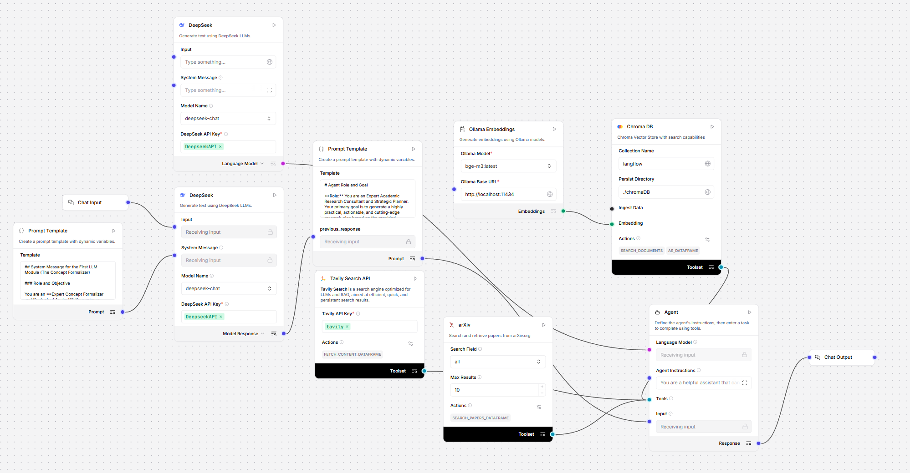
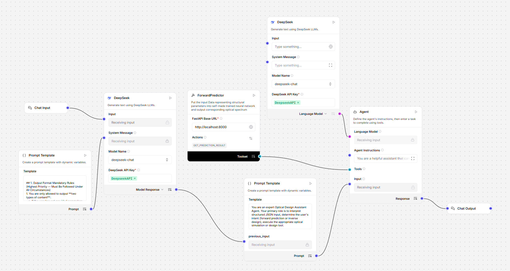
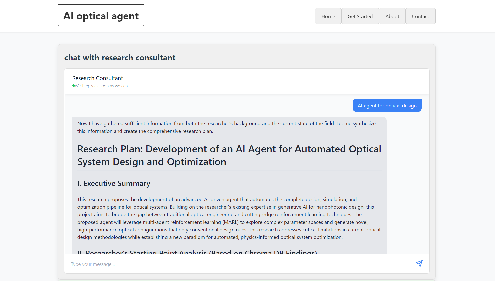
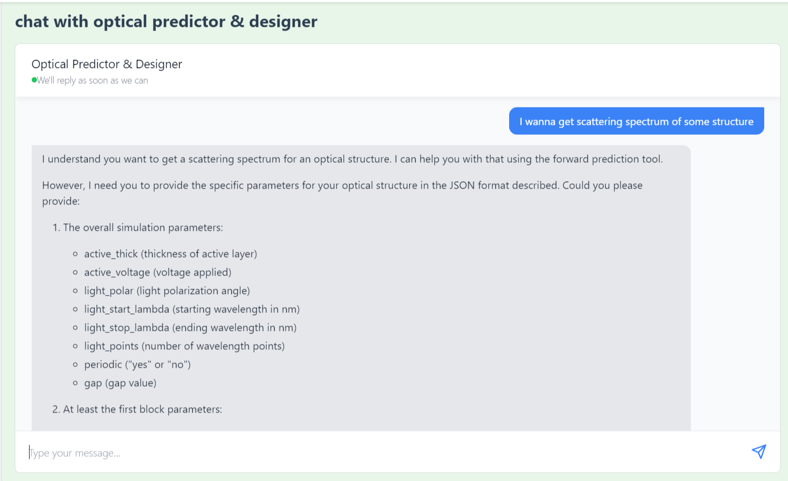
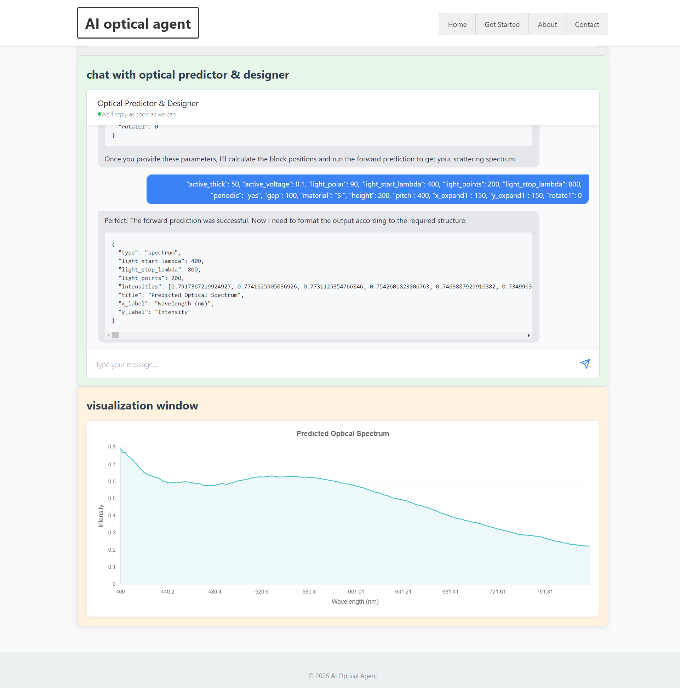

# OpticalAgent: AI-Assisted Toolkit for Optical Engineering

## Project Overview
OpticalAgent is an AI-powered auxiliary toolkit tailored for the optics and photonics domain, currently released as an **initial local testing version** (with follow-up production-level optimization in progress). Built on the Langflow platform, its core differentiator lies in the integration of **domain-specific optical model APIs** and self-developed custom tools for agent workflows—not just relying on low-code flow configuration or frontend customization. This design enables intelligent agents to autonomously invoke professional optical computing capabilities, providing targeted support for optical research and design scenarios.

## Core Features
OpticalAgent includes two core agent workflows, with the optical model API integration as a key functional highlight:
### 1. Research Planner
Assists users in formulating structured research plans for optics and photonics projects. By leveraging arXiv-based academic resource retrieval and domain analysis capabilities, it generates actionable research roadmaps, helping users quickly identify cutting-edge research directions and technical paths.

### 2. Optical Designer
Focuses on optical device design tasks, with its core value reflected in the connection between conversational interaction and professional optical computing:
- **Optical Model API Invocation**: The workflow integrates a custom-developed tool that calls standardized APIs of specialized optical AI models (e.g., [OpticalGraphormer](https://github.com/JYJiahaoYan/OpticalGraphormer)), realizing automated optical parameter prediction and design optimization.
- **Guided Parameter Input**: Through natural language dialogue, the agent guides users to complete the input of required optical parameters, ensuring the validity of data submitted to the model API.
- **Visualized Result Output**: The frontend will render the spectral data returned by the optical model in real time, allowing users to intuitively analyze the design effect.

## Technical Architecture
### 1. Workflow Construction
- Two core agent workflows are built via the **Langflow** platform. Workflow Screenshots:  
    
  

### 2. LLM Integration
- Uses the open-source **DeepSeek API** as the default model for basic dialogue and logical reasoning.
- Supports flexible replacement with other LLMs (Anthropic Claude, OpenAI GPT, Google Generative AI, etc.) by adjusting component parameters in the Langflow interface.

### 3. Retrieval-Augmented Generation (RAG)
- **Embedding Model**: Adopts `bge-m3` as the default embedding model (managed by Ollama, compatible with `nomic-embed-text`, `mxbai-embed-large` and other models supported by Langflow).
- **Vector Database**: Uses Chroma to store embedding vectors, enabling efficient document retrieval and semantic matching for domain knowledge supplementation.

### 4. External Tool Integration (Key Innovation)
- **Public Resource Tools**: Integrates arXiv API for academic literature retrieval and Tavily API for real-time web information acquisition to supplement domain trends.
- **Custom Optical Model Tool**: For the Optical Designer workflow, a dedicated tool is developed to encapsulate the APIs of specialized optical models into agent-callable functions. This module realizes the docking between general agent logic and professional optical computing, which is the core functional module distinguishing it from ordinary low-code agent platforms.

### 5. Frontend Interaction
- Based on the Langflow Embedded Chat module, the chat interface is adjusted in style and function to support contextual dialogue and tool invocation process visualization.
- Added a spectral data visualization module to render the results returned by the optical model API in the form of curves, facilitating users to analyze design outcomes.

## Installation & Configuration
### Prerequisites
- Python 3.8+ (3.12.11 is recommended for full compatibility)
- Node.js 16+
- Ollama (for embedding model management)
- Langflow (v1.6.4 is recommended, with core runtime being langflow-base v0.6.4)
- Core Python dependencies (installable via Conda/Pip):
  - LLM framework: langchain (0.3.23), langchain-core (0.3.79), langgraph (0.6.10)
  - Scientific computing: numpy (2.2.6), scipy (1.16.1), pandas (2.2.3), opencv-python (4.12.0.88)
  - Vector storage: faiss-cpu (1.9.0.post1), chromadb (1.1.1)
  - LLM integration: openai (1.109.1), anthropic (0.69.0), langchain-openai (0.3.35)
  - Web service: fastapi (0.118.2), uvicorn (0.37.0)
- All dependencies required by the [OpticalGraphormer project](https://github.com/JYJiahaoYan/OpticalGraphormer)

### Configuration Steps
1. Clone the repository:
   ```bash
   git clone <repository-url>
   cd OpticalAgent
   ```
2. Backend Environment Setup:
   - Start Langflow with custom components, and then import the json files in `app/workflows` into your Langflow environment to generate workflows:
     ```ini
     uv run langflow run --components-path /your_path/OpticalAgent/app/custom_components
     ```
   - Create a `.env` file (for Python-based debugging) and fill in the required API keys:
     ```ini
     LANGFLOW_API_KEY=your_langflow_api_key
     DEEPSEEK_API_KEY=your_deepseek_api_key
     TAVILY_API_KEY=your_tavily_api_key
     ARXIV_API_KEY=your_arxiv_api_key  # Required for specific scenarios
     OPTICAL_MODEL_API_URL=your_optical_graphormer_api_url  # API endpoint for OpticalGraphormer
     ```
   - Start Ollama and load the embedding model
   - Launch the OpticalGraphormer model API:
     ```ini
     uvicorn api.inference_api.main:app --port 8000
     ```
3. Frontend Environment Setup:
   - Install frontend dependencies:
     ```bash
     cd frontend/langflow-embedded-chat
     npm run build
     ```
   - Create `frontend/local-config.json` (configuration injected into HTML):
     ```json
     {
       "langflowApiKey": "your_langflow_api_key",
       "langflowHostUrl": "http://localhost:3000",
       "researchFlowId": "your_research_planner_flow_id",
       "opticalFlowId": "your_optical_designer_flow_id"
     }
     ```

## Interface Demonstration
1. **Research Planner Interface**  
   Supports research plan generation, literature retrieval, and analysis:  
   
2. **Optical Designer Interface & Spectrum Visualization**  
   Enables optical design parameter input and conversational interaction:
   - If the input does not meet the parameter requirements of optical forward prediction, the agent will guide the user to supplement information step by step.  
     
   - If the input parameters are valid, the agent will call the optical model API to output spectral data, which will be simultaneously displayed in the visualization window.  
     

## Future Development Roadmap
This version is the initial commit of the project, and the following optimization directions are planned for subsequent iterations to upgrade from the local test version to a production-level tool:
1. **Production-Grade Deployment**  
   Introduce Docker for environment containerization to ensure deployment consistency, and further use Kubernetes for cluster management to support multi-user concurrent access and resource scheduling.
2. **Framework Independence Optimization**  
   Gradually reduce reliance on Langflow/LangChain frameworks, and develop a dedicated agentic workflow engine to improve the execution efficiency of optical computing-related tasks and enhance the flexibility of workflow customization.
3. **Expansion of Optical Tool Library**  
   Integrate more types of optical models (e.g., waveguide design, laser performance simulation models) into the agent tool system, expand application scenarios, and support multi-step optical design task chains (e.g., inverse design → forward verification → parameter optimization).

